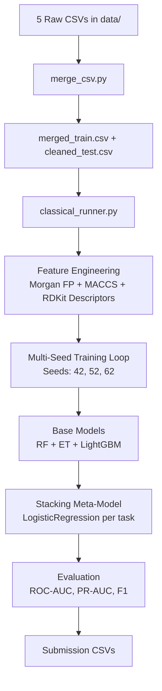

# EUOS25 Classical Pipeline — Complete Walkthrough

A detailed end-to-end explanation of how the `classical_runner.py` pipeline works, how it's executed on HPC, and what every stage produces.

---

## High-Level Architecture



---

## 1. Input Data

Raw CSVs live in `D:\EUOS25\data\`:

| File | Rows | Task |
|------|------|------|
| `euos25_challenge_train_fluorescence480.csv` | ~69k | Fluorescence at 480nm excitation |
| `euos25_challenge_train_fluorescence340_450.csv` | ~69k | Fluorescence at 340nm→450nm |
| `euos25_challenge_train_transmittance450.csv` | ~69k | Absorption (450–679nm avg) |
| `euos25_challenge_train_transmittance340.csv` | ~69k | Absorption at 340nm |
| `euos25_challenge_test.csv` | 29,420 | Test set (ID + SMILES only) |

These are merged by `merge_csv.py` into:
- `merged_train.csv` — 68,972 rows × 6 columns (`ID`, `SMILES`, `Fluorescence480`, `Fluorescence340_450`, `Transmittance450`, `Transmittance340`)
- `cleaned_test.csv` — 29,420 rows × 2 columns (`ID`, `SMILES`)

### Class Imbalance (from HPC log)

| Task | Positives | % Positive |
|------|-----------|------------|
| **Fluorescence480** | 164 | **0.24%** ← extreme |
| Fluorescence340_450 | 11,509 | 16.7% |
| Transmittance450 | 1,016 | 1.5% |
| Transmittance340 | 3,888 | 5.6% |

---

## 2. How the Pipeline is Launched (HPC)

### The SBATCH File: `classical_runner.sbatch`

```bash
#!/bin/bash
#SBATCH --job-name=EuosClassicalv3
#SBATCH --partition=zen5_mpi
#SBATCH --nodes=1
#SBATCH --ntasks=1
#SBATCH --cpus-per-task=80       # 80 CPU cores
#SBATCH --mem=128G               # 128 GB RAM
#SBATCH --time=20:00:00          # 20-hour limit
#SBATCH --output=logs/%x_%j.out  # → logs/EuosClassicalv3_<jobid>.out

module purge
module load Mamba
source $EBROOTMAMBA/etc/profile.d/conda.sh

cd /scratch/brussel/vo/000/bvo00026/vsc11013/Projects/EUOS25

SIF=/scratch/brussel/vo/000/bvo00026/vsc11013/Projects/EUOS25/singularity/euos25_classical.sif

apptainer exec -B "$PWD":/work "$SIF" python /work/classical_runner.py
```

### How to Submit

```bash
# From the HPC login node, in the project directory:
sbatch classical_runner.sbatch
```

### What Happens on Submission

1. SLURM allocates **1 node, 80 CPUs, 128 GB RAM** on the `zen5_mpi` partition
2. The **Singularity/Apptainer container** (`euos25_classical.sif`) is launched — it contains Python 3.10 with all dependencies pre-installed
3. The container bind-mounts the project directory as `/work`
4. `python /work/classical_runner.py` runs inside the container
5. All stdout/stderr goes to `logs/EuosClassicalv3_<jobid>.out`

---

## 3. The Pipeline Code — Step by Step

### Entry point: `classical_runner.py`

The script imports from the modular `euos25/` package and runs a `main()` function.

---

### Step 3.1 — Configuration (Lines 33–74)

```python
TRAIN_CSV = "merged_train.csv"
TEST_CSV  = "cleaned_test.csv"
LABEL_COLS = ["Fluorescence480", "Fluorescence340_450",
              "Transmittance450", "Transmittance340"]

SEEDS = [42, 52, 62]     # 3 seeds for robust ensembling
N_SPLITS = 5             # 5-fold stratified CV
```

**Feature settings:**
- Morgan fingerprints at radii 2 and 3 (ECFP4 + ECFP6), 2048 bits each
- MACCS fingerprint keys (167 bits)
- 15 RDKit molecular descriptors (MolWt, LogP, TPSA, etc.)
- Descriptors are standardized (zero mean, unit variance) using the train set transform

**Model toggles:**
- `USE_RF = True` — RandomForest (400 trees)
- `USE_ET = True` — ExtraTrees (800 trees)
- `USE_LGBM = True` — LightGBM (5000 rounds with early stopping)
- `USE_PLS = False` — disabled
- `USE_CB = False` — CatBoost disabled
- `USE_STACKING = True` — meta-learner stacking enabled

---

### Step 3.2 — Feature Computation (Lines 151–171)

Source: `euos25/features/classical.py`

For **each molecule** (SMILES string):

1. **Parse SMILES** → RDKit Mol object
2. **Morgan Fingerprints**: Radius 2 (ECFP4) → 2048 bits + Radius 3 (ECFP6) → 2048 bits = **4096 bits**
3. **MACCS Keys**: 167-bit structural key fingerprint = **167 bits**
4. **RDKit Descriptors**: 15 physicochemical properties:

| # | Descriptor | Description |
|---|---|---|
| 1 | MolWt | Molecular weight |
| 2 | MolLogP | Wildman–Crippen LogP (lipophilicity) |
| 3 | TPSA | Topological polar surface area |
| 4 | NumHDonors | Number of hydrogen bond donors |
| 5 | NumHAcceptors | Number of hydrogen bond acceptors |
| 6 | NumRotatableBonds | Number of rotatable bonds |
| 7 | RingCount | Total ring count |
| 8 | NumAromaticRings | Count of aromatic rings |
| 9 | FractionCSP3 | Fraction of sp3-hybridised carbons |
| 10 | HeavyAtomCount | Total number of non-hydrogen atoms |
| 11 | NHOHCount | Count of NH and OH groups |
| 12 | NOCount | Count of nitrogen and oxygen atoms |
| 13 | NumAliphaticRings | Number of aliphatic ring systems |
| 14 | NumSaturatedRings | Number of fully saturated rings |
| 15 | MolMR | Molar refractivity |

5. All concatenated into a single feature vector per molecule: **4,278 total dimensions** (4096 + 167 + 15)

**Descriptor Transform:** The mean/std of the 15 descriptors is computed on the **training set only**, then applied to both train and test (preventing data leakage).

**Output:** Two numpy arrays saved as `outputs/X_train.npy` (~1.1 GB) and `outputs/X_test.npy` (~503 MB).

> **Note:** The thousands of `DEPRECATION WARNING: please use MorganGenerator` messages in the HPC log come from this step — RDKit's older `GetMorganFingerprintAsBitVect` API is deprecated in favor of the newer `MorganGenerator`. These are harmless warnings.

---

### Step 3.3 — Multi-Seed Training Loop (Lines 178–279)

The pipeline loops over **3 seeds** (42, 52, 62). For each seed:

#### Base Model Training

Each model family trains **independently** via 5-fold Stratified K-Fold CV. Stratification is based on whether a sample has **any positive label** across all 4 tasks.

**For each fold × each task**, a separate model is trained:

| Model Family | Function | Key Parameters |
|---|---|---|
| **RandomForest** | `train_random_forest_cv()` | 400 trees, `class_weight="balanced_subsample"` |
| **ExtraTrees** | `train_extra_trees_cv()` | 800 trees, `class_weight="balanced_subsample"` |
| **LightGBM** | `train_lightgbm_cv()` | 5000 rounds, early stopping at 100, `num_leaves=127`, `scale_pos_weight=neg/pos` |

Source: `euos25/models/classical.py` — contains all training functions.

Each function returns:
- **OOF predictions**: Out-of-fold probabilities for the entire training set (honest, no leakage)
- **Trained models**: One model dict per fold (keys = task names)

---

### Step 3.4 — Stacking Meta-Model (Lines 81–130, 244–269)

This is the core ensembling strategy. Instead of simply averaging, a **second-level model** learns how to optimally combine the base models.

#### How It Works

1. Stack the OOF predictions from all base models into a **3D cube**: `(n_samples, n_models, n_tasks)` — e.g., shape `(68972, 3, 4)` for 3 model families × 4 tasks
2. **For each task independently:**
   - Use the base model OOF predictions as **meta-features** (3 features = RF prob, ET prob, LGBM prob)
   - Train a **LogisticRegression** (`C=1.0`, `class_weight="balanced"`) via another 5-fold CV to produce honest meta-OOF predictions
3. After meta-OOF is computed, fit a **final LogisticRegression** on the **full** base OOF data (for test-time inference)

#### Test Inference

1. Each base model family predicts on test data → average across folds
2. Stack these into `(n_test, n_models, n_tasks)`
3. The final meta LogisticRegression produces the submission probabilities

---

### Step 3.5 — Evaluation (Lines 254–257)

Source: `euos25/eval.py`

For each seed, the meta-OOF predictions are evaluated against ground truth. Metrics computed:

- **ROC-AUC** (primary competition metric)
- **PR-AUC** (precision-recall AUC)
- **Precision, Recall, F1**
- **Optimal threshold** (searched via F1 maximization)
- **Confusion matrices**, **ROC curves**, **PR curves** (saved as PNG)

Everything is saved to `outputs/eval/`.

---

### Step 3.6 — Seed Averaging & Submission (Lines 281–304)

After all 3 seeds finish, the test predictions are **averaged across seeds**, producing the final probabilities.

Two submission files are written:

| File | Format |
|------|--------|
| `submission_classical.csv` | Internal format (ID + 4 probability columns) |
| `submission_classical_EUOS25.csv` | EUOS upload format with renamed columns |

The EUOS format renames columns to:
`Transmittance(340)`, `Transmittance(450)`, `Fluorescence(340/450)`, `Fluorescence(>480)`

---

## 4. Results from the Last HPC Run

Job: `EuosClassicalv3` (ID: 11316117)

### Per-Seed Stacking AUC Results

| Task | Seed 42 | Seed 52 | Seed 62 |
|------|---------|---------|---------|
| **Fluorescence480** | 0.580 | 0.603 | 0.606 |
| **Fluorescence340_450** | **0.870** | **0.871** | **0.869** |
| **Transmittance450** | 0.648 | 0.645 | 0.655 |
| **Transmittance340** | **0.844** | **0.845** | **0.846** |

> **Important:** **Fluorescence480** has very low AUC (~0.59) due to extreme class imbalance (only 164 positives out of 69K). **Fluorescence340_450** and **Transmittance340** perform well (~0.87 and ~0.85).

### Generated Evaluation Artifacts

Per seed (×3): ROC curves, PR curves, confusion matrices, and metrics CSVs for all 4 tasks — **42 files total** in `outputs/eval/`.

---

## 5. The `euos25/` Package Structure

```
euos25/
├── __init__.py            # Package init, exposes all submodules
├── config.py              # Euos25Config dataclass (defaults)
├── io.py                  # Data loading, CSV merging utilities
├── ensemble.py            # average_model_predictions() — fold-averaged inference
├── eval.py                # evaluate_predictions() — AUC, PR, confusion matrix, plots
├── features/
│   ├── __init__.py
│   ├── classical.py       # compute_feature_matrix() — Morgan FP + MACCS + descriptors
│   ├── augmentation.py    # SMILES augmentation (tautomers, randomized SMILES)
│   └── graphs.py          # Graph-based featurization (for GNN models)
└── models/
    ├── __init__.py
    ├── classical.py        # RF, ET, PLS, CatBoost, XGBoost, LightGBM training functions
    └── gnn.py              # GNN model definitions (for advanced pipeline)
```

---

## 6. Environment & Dependencies

### Conda Environment: `env.yml`

Core dependencies: `python 3.11`, `pandas`, `numpy`, `scikit-learn`, `rdkit`, `lightgbm`, `catboost`, `xgboost`, `matplotlib`, `seaborn`

### Singularity Container

The HPC run uses a pre-built Singularity image at `singularity/euos25_classical.sif` which contains all dependencies. The container's internal Python environment is at `/opt/micromamba/envs/euos25/` (Python 3.10).

---

## 7. How to Re-Run

### On HPC (SLURM)

```bash
cd /scratch/brussel/vo/000/bvo00026/vsc11013/Projects/EUOS25
sbatch classical_runner.sbatch
# Monitor:
squeue -u $USER
tail -f logs/EuosClassicalv3_*.out
```

### Locally (if dependencies are installed)

```bash
cd D:\EUOS25
python classical_runner.py
```

### Quick Run (single seed)

Edit `classical_runner.py` line 50:
```diff
-SEEDS = [42, 52, 62]
+SEEDS = [42]  # Quick single-seed run
```

---

## 8. Key Knobs to Tune

| Parameter | Location | Current Value | Notes |
|-----------|----------|---------------|-------|
| `SEEDS` | Line 50 | `[42, 52, 62]` | More seeds = more robust, slower |
| `N_SPLITS` | Line 51 | `5` | CV folds |
| `radii` | Line 57 | `(2, 3)` | ECFP4+6; try `(2, 3, 4)` for ECFP8 |
| `n_bits` | Line 58 | `2048` | FP length; try 4096 |
| `use_counts` | Line 59 | `False` | Count-based FP often helps LGBM |
| `USE_PLS` | Line 68 | `False` | Weak alone, might help stacking diversity |
| `USE_CB` | Line 70 | `False` | Enable CatBoost (installed but off) |
| `META_C` | Line 74 | `1.0` | Regularization for stacking LR |
| `num_leaves` (LGBM) | Line 218 | `127` | Higher = more complex trees |

---

## 9. Relationship to `euos25_full_suite.py`

`euos25_full_suite.py` is the **original monolithic script** (1,289 lines) that contains everything in one file: EDA, augmentation, models, evaluation, and more. The `classical_runner.py` + `euos25/` package is the **refactored, modular version** of the same pipeline, broken into clean, reusable components. The `classical_runner.py` focuses specifically on the classical ML approach (no GNN/Transformer), making it easier to iterate on.
